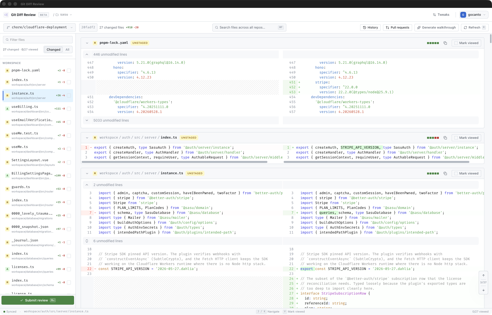
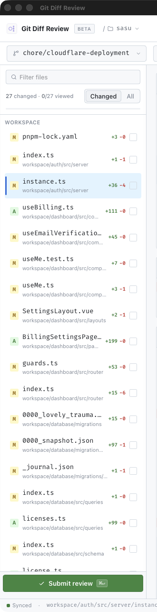
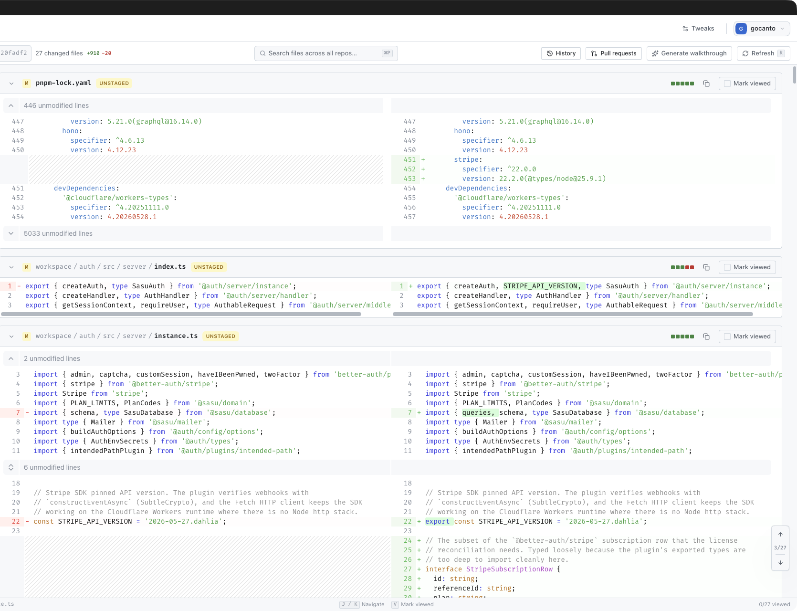
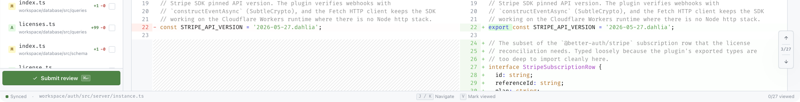
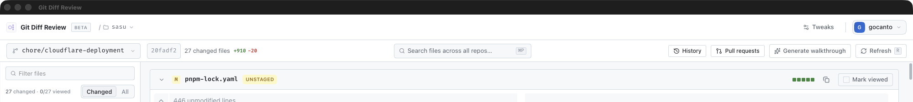

<div align="center">


# Git Diff Review

**Review your local Git changes like a pull request — before you commit.**
**On your machine. Nothing leaves it.**

[](LICENSE)
-black)
[](https://github.com/oullin/git-diff/releases)



</div>

Git Diff Review is a native macOS app that gives you a full GitHub-style review
surface for your **local working tree**. Open any repository, walk every changed
file, read the diff in split or unified view, mark files as you review them, leave
yourself notes and inline comments — then commit with confidence. It never pushes
your code anywhere.

## Why you need it

You commit changes you never actually re-read. `git diff` in the terminal is
cramped and easy to skim past. Opening a real pull request just to review your own
work is heavyweight — and it forces your code onto a server before it's ready.

Git Diff Review gives you the **pull-request review experience, locally**:

- Catch the debug log, the stray `TODO`, the half-finished refactor *before* it
  lands in history.
- Review with the same muscle memory you already have from GitHub — file list,
  viewed checkboxes, split diffs, inline comments.
- Keep everything on your machine. No cloud, no sign-up, no telemetry.

## What you get

- **A real review surface.** Navigate changed files with status badges and
  addition/deletion counts, jump between hunks, and search files across all your
  repos at once.
- **Staged, unstaged, and untracked** — see every kind of change, with rename
  detection and whitespace noise you can hide.
- **Split or unified diffs** with syntax highlighting, your choice per session.
- **Viewed-file tracking.** Tick files off as you go (`0/14 viewed`) so you never
  lose your place in a large change.
- **Notes and inline comments.** Write a rich-text review summary and drop inline
  comments on specific lines — stored locally and kept across sessions.
- **Branch, commit, and PR context.** Switch branches, pin a commit to review
  against, and browse pull requests and history without leaving the app.
- **AI walkthroughs (optional).** Generate a guided walkthrough of a change to get
  oriented fast.
- **Keyboard-driven.** `j`/`k` to navigate, `v` to mark viewed, `c` to comment,
  `⌘↵` to submit — review without touching the mouse.
- **Native and local.** A fast Electron + Vue interface backed by a Go engine that
  reads Git directly and stores your reviews in local SQLite.

## See it in action

| | |
| --- | --- |
|  |  |
| **Walk every changed file** with status, counts, and viewed tracking. | **Read split or unified diffs** with syntax highlighting. |
|  |  |
| **Leave notes and inline comments** as you review. | **Generate an AI walkthrough** to get oriented fast. |

> Screenshots live in [`docs/images/`](docs/images/). See that folder's README for
> what each capture should show.

## Install

> **macOS on Apple Silicon.** The app is currently in beta and distributed
> unsigned, so macOS Gatekeeper needs one extra click on first launch.

**Download the app**

1. Grab the latest `.dmg` from the
   [Releases page](https://github.com/oullin/git-diff/releases).
2. Open it and drag **Git Diff Review** to Applications.
3. On first launch, **right-click the app → Open**, then confirm. (macOS blocks
   unsigned apps on a normal double-click; right-click → Open only needs doing
   once.)

**Homebrew** _(planned)_

```sh
brew install --cask oullin/tap/git-diff
```

## Your code stays yours

Git Diff Review reads your repository state through Git and serves a local API over
a Unix socket — it talks only to your machine. Review sessions, comments, events,
and preferences are stored in a local SQLite database at:

```text
~/Library/Application Support/git-diff/reviews.sqlite3
```

It **does not** publish comments to GitHub, create pull requests, or modify your
repository contents. It's a review surface, nothing more.

## Build from source

Git Diff Review is a pnpm + Turbo monorepo pairing an Electron/Vue/TypeScript
desktop app with a Go backend.

| Path              | Role                                                                        |
| ----------------- | --------------------------------------------------------------------------- |
| `packages/ui`     | Electron/Vue desktop app and renderer UI.                                   |
| `packages/bridge` | TypeScript HTTP client used by Electron.                                    |
| `packages/domain` | Shared DTOs + framework-agnostic diff logic, consumed by `ui` and `bridge`. |
| `packages/api`    | Go backend that reads Git diffs and stores reviews.                         |
| `packages/tools`  | Turbo cache wrapper and unsigned macOS release helper.                      |

To set up the toolchain, run it locally, and learn the development commands, see
**[docs/development.md](docs/development.md)**. For packaging, signing, and the
release pipeline, see **[docs/distribution.md](docs/distribution.md)**.

## License

[MIT](LICENSE) © Gus Canto
